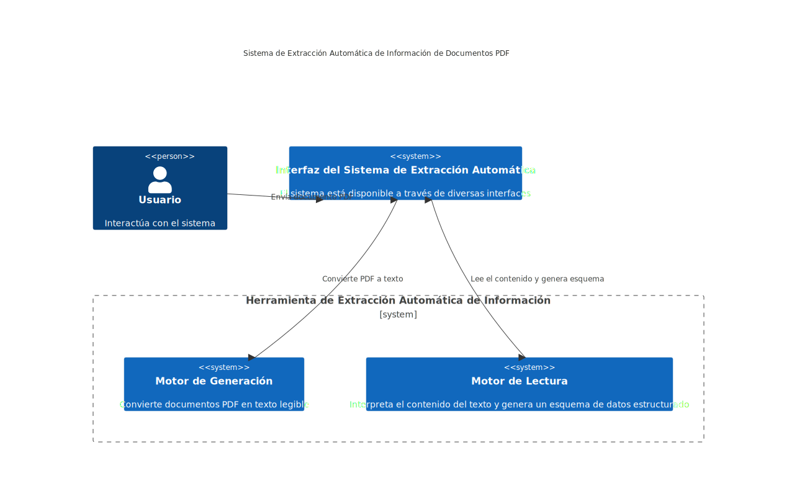
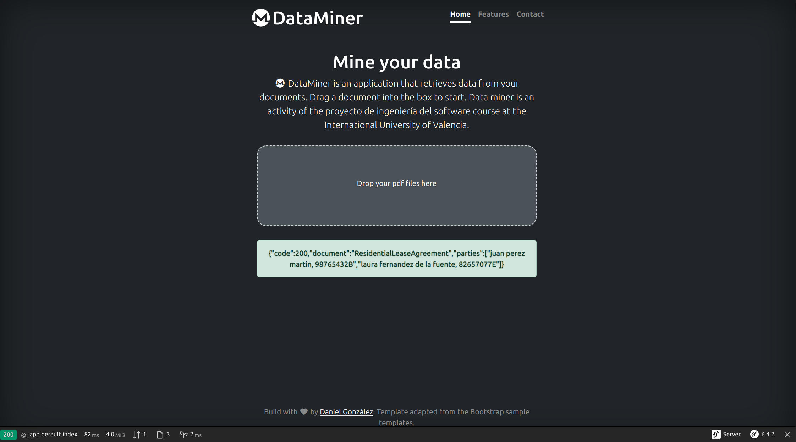
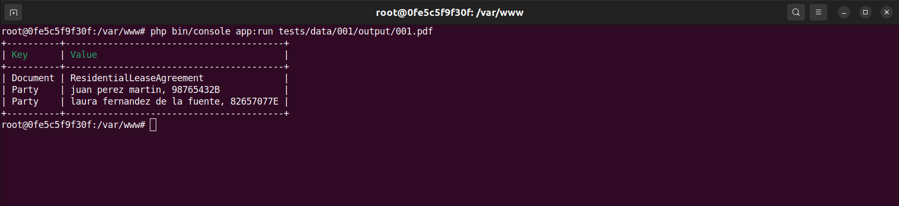
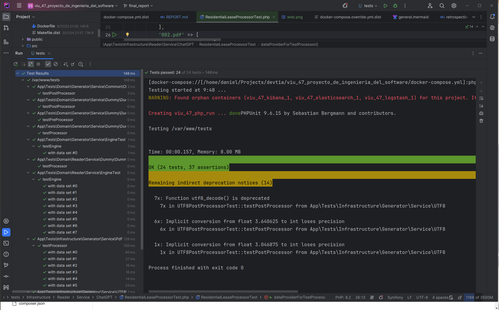
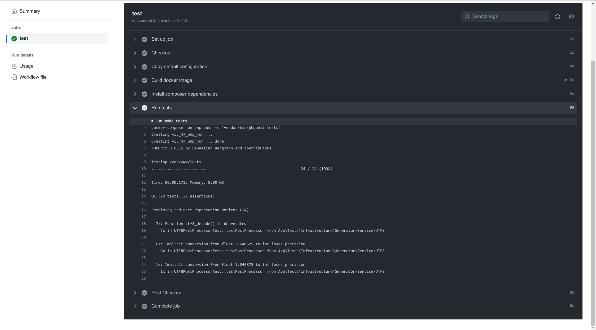

# Proyecto de Ingeniería de Software

## Introducción

### Descripción del proyecto

Hemos ha creado una solución tecnológica avanzada que transforma los datos no estructurados de documentos PDF en
formatos estructurados y utilizables.

Imaginemos el caso práctico de una compañía de seguros que procesa contratos de arrendamiento. En lugar de la revisión
manual y la extracción de datos por parte de un experto, nuestro sistema automatiza completamente el proceso.

Esta automatización no solo optimiza la eficiencia, sino que también permite que las empresas reasignen su fuerza
laboral a roles que generan mayor valor añadido.

### Alcance

El software que hemos desarrollado hasta ahora sirve como una base conceptual y prototipo inicial.

Aunque ha demostrado la viabilidad de la idea, aún requiere validación extensiva y mejoras antes de que esté listo para
su implementación en entornos de producción real.

Nuestro próximo objetivo es abrir el proyecto a la comunidad, convirtiéndolo en una iniciativa de código abierto. Esto
no solo incluirá la mejora y ampliación de la documentación existente, sino también la traducción al inglés para
facilitar su adopción y contribución global. Además, planeamos desarrollar más funcionalidades y realizar pruebas
exhaustivas para asegurar la robustez y fiabilidad del software.

También tenemos planeado utilizar y ampliar este trabajo durante el desarrollo del trabajo de fin de grado.

### Metodología de desarrollo

Nuestro proyecto se ha desarrollado con la metodología Extreme Programming (XP), una metodología ágil que enfatiza la
adaptabilidad y la colaboración del equipo. Hemos adoptado prácticas como la integración continua y el desarrollo
orientado a pruebas para mejorar la calidad del código y la respuesta a los cambios.

Toda la documentación, escrita en Markdown y los diagramas en Mermaid para facilitar su comprensión, todo ello han
publicado en el repositorio público en GitHub, promoviendo la transparencia y la colaboración abierta.

Hemos gestionado el flujo de trabajo utilizando un tablero Kanban en GitHub Projects, lo que ha permitido un seguimiento
visual y eficiente del progreso.

Los sprints planificados cada dos semanas, estructurados en milestones, han impulsado un ciclo de lanzamiento iterativo
y consistente.

Los eventos de planificación de sprints, las demostraciones de funcionalidades y las retrospectivas se han grabado y
compartido en YouTube para documentar el proceso y recibir retroalimentación del profesor y del resto de compañeros.

Este enfoque nos ha permitido iterar rápidamente y adaptarnos a las necesidades, manteniendo un alto estándar de calidad
del software.

## Diseño de la Solución

### Arquitectura del software

La arquitectura del software ha sido un pilar fundamental en este proyecto, centrada en crear una base modulable y
extensible a través de la "arquitectura limpia".

Esta filosofía prioriza la separación del código de su implementación, facilitando la sustitución y actualización de
componentes.

Hemos diseñado el sistema con dos componentes principales, el Generator y el Reader:

Esta estructura no solo promueve la eficiencia y adaptabilidad, sino que también asegura la calidad y
mantenibilidad del código, permitiendo que el sistema se ajuste y evolucione según las necesidades futuras.

#### Generator

Este componente actúa como el motor inicial del proceso, encargado de transformar documentos PDF en texto
plano. Se compone de tres subcomponentes:

* Preprocesadores: Preparan el documento para el análisis, realizando ajustes como la modificación del contraste
  para optimizar el reconocimiento por OCR, asegurando que el texto sea lo más legible posible.
* Procesadores: Son el corazón del generador, donde el documento se convierte efectivamente en texto. Mediante un
  sistema de competición, diferentes procesadores evalúan su idoneidad para manejar el documento específico,
  seleccionando el más adecuado para ejecutar la tarea.
* Postprocesadores: Refinan el texto resultante, eliminando imperfecciones como caracteres no UTF-8 o espacios en
  blanco superfluos, mejorando así la calidad y la coherencia del texto final.

#### Reader

Este componente tiene un enfoque más singular, encargado de interpretar y procesar el texto plano resultante. Funciona
mediante una capa de procesadores que, similar al generador, compite entre sí para determinar el más adecuado para
analizar y extraer la información estructurada requerida del texto. Este proceso está diseñado para maximizar la
precisión y eficiencia en la extracción de datos.

### Arquitectura del sistema

Para garantizar que nuestro software funcione correctamente en cualquier entorno, hemos optado por Docker y Docker
compose, una solución para estandarizar los entornos de ejecución.

La configuración Docker facilita la creación de un entorno PHP para el proyecto, definiendo volúmenes para el código
fuente y configurando variables de entorno esenciales.

Paralelamente, el stack ELK se despliega a través de contenedores separados, asegurando una integración fluida de
servicios de análisis y visualización de datos. Esto no solo simplifica la implementación y escalabilidad del proyecto
sino que también mejora la reproducibilidad y la facilidad de mantenimiento en diferentes entornos de desarrollo y
producción.

Durante el proceso de desarrollo llegamos a instalar un contenedor con el LLM ollama2 que finalmente descartamos por no
ser lo suficientemente eficiente en tiempos de ejecución.

### Modelo de datos implementado

Aunque no se ha diseñado un modelo de datos tradicional en una base de datos, cada componente tiene una estructura de
objetos que podría ser fácilmente persistido utilizando una tecnología ORM si fuera necesario.

Este enfoque nos permite mantener la agilidad del proyecto, asegurando al mismo tiempo que la información se organiza de
manera lógica y eficiente, preparada para una eventual persistencia de datos.

### Interfaces de usuario

Nuestro proyecto incorpora dos interfaces de usuario diseñadas con un enfoque en la simplicidad y la eficiencia.

Esta dualidad asegura que nuestro sistema sea accesible y útil para una amplia gama de usuarios, desde los menos
técnicos hasta los más experimentados.

#### Interfaz web

La interfaz web se beneficia de herramientas de código abierto para ofrecer una experiencia de usuario fluida y directa,
permitiendo a los usuarios arrastrar y soltar documentos PDF para su procesamiento inmediato, y recibir feedback en un
formato conversacional similar al de un chat.

#### Interfaz de línea de comandos

Paralelamente, la interfaz de línea de comandos (CLI) proporciona una alternativa poderosa para usuarios técnicos,
permitiendo la especificación de rutas de archivos PDF para su procesamiento y la integración en otros programas y/o
procesos.

### Pruebas

La metodología de pruebas ha sido esencial en nuestro proyecto desde sus inicios, enfocándonos inicialmente en
establecer un conjunto de datos de prueba representativo utilizando contratos de arrendamiento de vivienda.

#### Conjunto de datos de prueba

Este proceso implicó la selección, adaptación y completamiento de modelos de contratos disponibles en línea para
ajustarse a nuestras necesidades.

Se establecieron tres conjuntos de datos de prueba.

* **000** ejemplos de documentos vacíos o texto sin sentido.
* **001** contratos de arrendamiento de vivienda.
* **002** contratos de compraventa de vehículos entre particulares.

#### Pruebas automáticas

Seguidamente, adoptamos un enfoque de desarrollo guiado por pruebas (TDD), implementando pruebas unitarias para cada
funcionalidad, lo que nos permitió validar continuamente la integridad del código a medida que avanzábamos.

#### Integración continua

Para reforzar la calidad y la fiabilidad del software, integramos un sistema de integración continua mediante GitHub
Actions, lo que nos permitió ejecutar automáticamente nuestra suite de pruebas con cada commit, garantizando así que
cualquier cambio en el código no comprometiera la funcionalidad existente.

Este enfoque comprensivo hacia las pruebas no solo mejoró la calidad del software, sino que también facilitó un
desarrollo más ágil y confiable.

## Resultados y conclusiones

### Funcionalidades implementadas

A pesar de los desvíos respecto a los requisitos iniciales, las negociaciones con el profesor tanto al inicio como
durante el seguimiento validaron que las funcionalidades desarrolladas cumplen con los objetivos educativos de la
asignatura.

El proyecto ha resultado en un sistema capaz de extraer información automáticamente de documentos PDF, gracias a una
arquitectura diseñada para la facilidad de modificación y extensión.

Incorpora tanto una interfaz web interactiva para usuarios como una interfaz de línea de comandos para la integración
con otros sistemas, demostrando una aplicación práctica y versátil de los conceptos de ingeniería de software.

### Metodología de desarrollo

La metodología de desarrollo adoptada enfrentó desafíos iniciales en la gestión de cargas de trabajo, resueltos
incrementando el esfuerzo diario.

Un retraso durante el #4 sprint fue corregido rápidamente en el siguiente, demostrando la flexibilidad y eficacia del
enfoque seleccionado.

La comunicación continua con el profesor fueron clave para el éxito del proyecto, permitiendo realizar ajustes que se
alinearon bien con los objetivos y la naturaleza del trabajo.

### Análisis de los resultados

Este proyecto persigue tres objetivos estratégicos: primero, superar la asignatura GIIN 47 Proyectos de Ingeniería del
Software, un logro que parece prometedor a la espera de la presentación final y el examen.

En segundo lugar, servirá como piedra angular para el trabajo de fin de grado, buscando aún la guía de un tutor con
experiencia relevante en la materia para avanzar en el desarrollo tecnológico.

Por último, se aspira a convertir este esfuerzo en un proyecto de código abierto, ofreciéndolo a la comunidad para su
aplicación en entornos productivos reales, maximizando así su impacto y utilidad.

## Apéndices

### Enlaces de interés

* [Repositorio de código](https://github.com/desarrolla2/viu_47_proyecto_de_ingenieria_del_software)
* [Sistema de seguimiento de proyecto](https://github.com/users/desarrolla2/projects/1/views/2)
* [Conjunto de datos de prueba](../../tests/data)
* [Instrucciones de instalación](../../INSTALL.md)
* Documentación generada durante el desarrollo de los sprints
    * **SPRINT 1**, Inicio 10/11/23, Final 23/11/2023
        * [milestone](https://github.com/desarrolla2/viu_47_proyecto_de_ingenieria_del_software/milestone/2)
        * demo: [video](https://youtu.be/BBw-5vUW-qg), [notas](../sprint_1/demo.md)
        * retrospectiva: [video](https://youtu.be/147mgtOAKNk), [notas](../sprint_1/retrospective.md)
    * **SPRINT 2**, Inicio 24/11/23, Final 07/12/2023
        * [milestone](https://github.com/desarrolla2/viu_47_proyecto_de_ingenieria_del_software/milestone/3)
        * plan: [video](https://youtu.be/lnvkIOcW5Pc), [notas](../sprint_2/plan.md)
        * demo: [video](https://youtu.be/j9hRxg8sHDc), [notas](../sprint_2/demo.md)
        * retrospectiva: [video](https://youtu.be/nJFgek1ibr4), [notas](../sprint_2/retrospective.md)
    * **SPRINT 3**, Inicio 08/12/23, Final 21/12/2023
        * [milestone](https://github.com/desarrolla2/viu_47_proyecto_de_ingenieria_del_software/milestone/4)
        * plan: [video](https://youtu.be/V_sAufMEgDI), [notas](../sprint_3/plan.md)
        * demo: [video](https://youtu.be/U2yilI_bNGU), [notas](../sprint_3/demo.md)
        * retrospectiva: [video](https://youtu.be/4sjOyIYCEzc), [notas](../sprint_3/retrospective.md)
    * **SPRINT 4**, Inicio 22/12/23, Final 04/01/2024
        * [milestone](https://github.com/desarrolla2/viu_47_proyecto_de_ingenieria_del_software/milestone/5)
        * plan: [video](https://youtu.be/ZSU2u2kAsHQ), [notas](../sprint_4/plan.md)
        * demo: [video](https://youtu.be/C5ynrUXmZBc), [notas](../sprint_4/demo.md)
        * retrospectiva: [video](https://youtu.be/_ijLWTfuC8c), [notas](../sprint_4/retrospective.md)
    * **SPRINT 5**, Inicio 05/01/24, Final 18/01/2024
        * [milestone](https://github.com/desarrolla2/viu_47_proyecto_de_ingenieria_del_software/milestone/6)
        * plan: [video](https://youtu.be/VbQfdDhFUTA), [notas](../sprint_5/plan.md)
        * demo: [video](https://youtu.be/saLs0HfclGA), [notas](../sprint_5/demo.md)
        * retrospectiva: [video](https://youtu.be/H7mB74ui5iA), [notas](../sprint_5/retrospective.md)
    * **SPRINT 6**, Inicio 19/01/24, Final 01/02/2024
        * [milestone](https://github.com/desarrolla2/viu_47_proyecto_de_ingenieria_del_software/milestone/7)
        * plan: [video](https://youtu.be/AcML0-qcm5Q), [notas](../sprint_6/plan.md)
        * demo: [video](https://youtu.be/f-00CNTTzwk), [notas](../sprint_6/demo.md)
        * retrospectiva: [video](https://youtu.be/Eg8BUbnQtJs), [notas](../sprint_6/retrospective.md)
